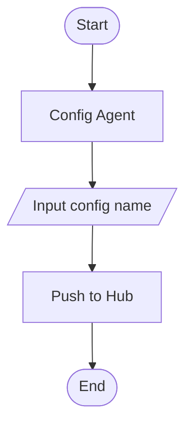
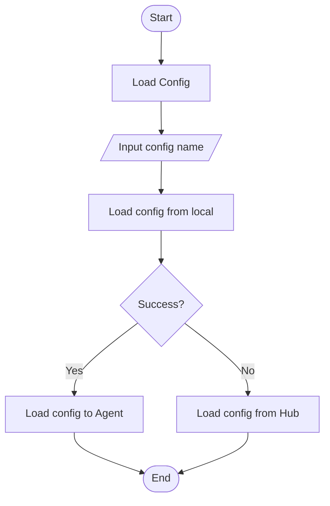

# Agent Config

## Push Config

```mermaid
flowchart TD

A([Start]) --> B[Config Agent]
B --> C[/Input config name/]
C --> D[Push to Hub]
D --> E([End])
```

## Load Config

```mermaid
flowchart TD

A([Start]) --> B[Load Config]
B --> C[/Input config name/]
C --> D[Load config from local]
D --> E{Success?}
E -->|Yes| F[Load config to Agent]
E -->|No| G[Load config from Hub]
F --> H([End])
G --> H
```
