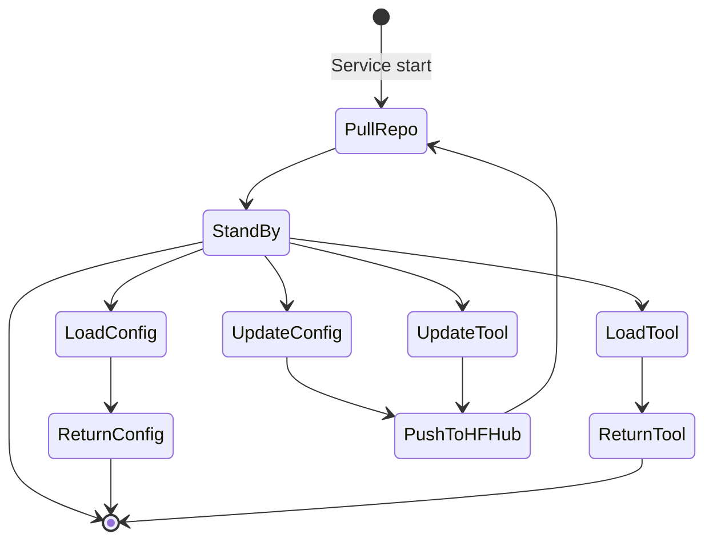

# Using Hugging Face Hub

The state diagram below shows the lifecycle of a service that uses the Hugging Face Hub to store and retrieve config and tool files.

```mermaid
stateDiagram-v2
    [*] --> PullRepo: Service start
    PullRepo --> StandBy
    StandBy --> LoadConfig
    StandBy --> LoadTool
    StandBy --> UpdateConfig
    StandBy --> UpdateTool
    LoadConfig --> ReturnConfig
    LoadTool --> ReturnTool
    UpdateConfig --> PushToHFHub
    UpdateTool --> PushToHFHub
    PushToHFHub --> PullRepo
    StandBy --> [*]
    ReturnConfig --> [*]
    ReturnTool --> [*]
```
